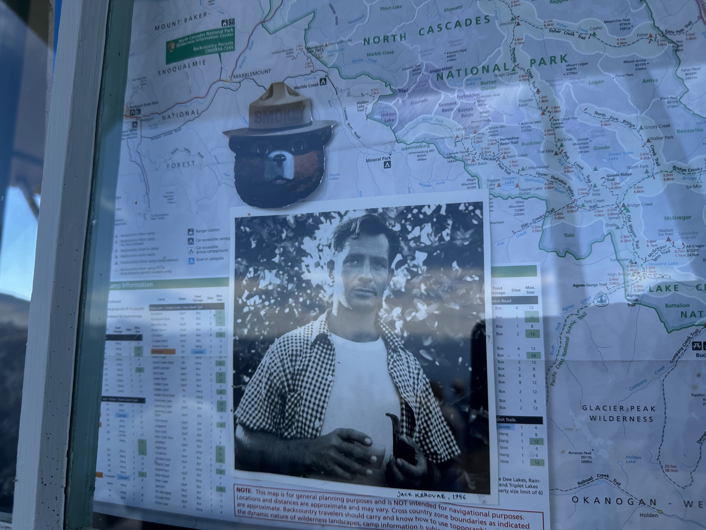
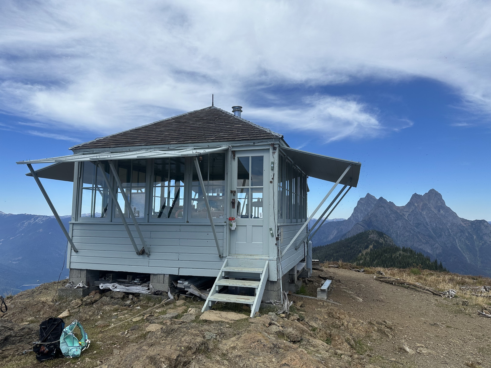

[_The Dharma Bums_](https://bookshop.org/a/111171/9780143039600) by Jack Kerouac.  This book---and this review thereof---has been a long time coming.^[Although I finished the book on May 29, because of traveling and other mishegas, this review was written just over a month later.]  Last summer, my partner and I spent a weekend camping at the north end of Ross Lake, just next to North Cascades National Park, and hiking up Desolation Peak.  This book ends with Kerouac^[Well, Ray Smith, the protagonist modeled on Kerouac.] spending a summer alone at the fire lookout station on top of Desolation, which he did in 1956.  The lookout has a photo of him from that year featured prominently in the window.
<figure>

<figcaption>A portrait of Kerouac from 1956, in the window of the Desolation Peak fire lookout.</figcaption>
</figure>

While I know the broad contours of Kerouac's life and influence^[A bit more than the other group on the summit who proudly read "Jack Kerouac was an American author" from Wikipedia.] and have read some things from some of his contemporaries (e.g. Burroughs), picking up _The Dharma Bums_ from the library was my first time actually reading any of his prose.  And what unique prose: the stream-of-consciousness, write-once style has a way of showing instead of telling the reader how to feel in many places.  For example, a page-long "run-on" "sentence" induces in the reader the very dizziness being described at one of the many parties we hear about in the book.

The broad contours: Smith is a bum, traveling around the US by hopping on to freight trains and hitch-hiking.  He spends extended time with his main friend Japhy in Berkeley^[Having spent a lot of time there and in some of the surroundings also described in this book, it was nice to have a bit of nostalgia thrown in.] and back east with his family for a winter.  Through Japhy, Smith explores both buddhist teachings and practices and climbs his first mountain (Matterhorn in California's Sierra Nevada).  A lot of these explorations are centered around poetry gatherings, both large in the city and small in the country side, and plenty of jugs of red wine (a source of tension for both Smith and Japhy) in parties of all shapes and sizes.   To be clear: the motivations throughout seem to be centered more on self-discovery and other forms of truth-seeking, and only very rarely in hedonism for its own sake.

The climb of Matterhorn instills in Smith the kind of joy that self-reliance and overcoming difficulty tends to do:  "It was great. I took off my sneakers and poured out a couple of buckets of lava dust and said "Ah Japhy you taught me the final lesson of them all, you can’t fall off a mountain.""  After all is said and done, he and Japhy split ways: the latter to Japan to stay in a monastery, and the former to his lookout at Desolation (and the long journey to get there).  Japhy remains a constant figure in Smith's inner monologue, influencing his thoughts that entire summer at the lookout.

His first night at the lookout: "In the middle of the night while half asleep I had apparently opened my eyes a bit, and then suddenly I woke up with my hair standing on end, I had just seen a huge black monster standing in my window, and I looked, and it had a star over it, and it was Mount Hozomeen miles away by Canada leaning over my backyard and staring in my window."

<figure>

<figcaption>The fire lookout on top of Desolation Peak where Kerouac spent the summer of 1956, with Hozomeen in the background.</figcaption>
</figure>

Two months (but only a couple of short chapters) later, the book ends: "as I was hiking down the mountain with my pack I turned and knelt on the trail and said "Thank you, shack" Then I added "Blah," with a little grin, because I knew that shack and that mountain would understand what that meant, and turned and went on down the trail back to this world."

Although I came for the stories about Desolatuion, I stayed for the riveting prose and the reflections on the meaningful life throughout.  I recommend you do the same. 
Grade: A- 