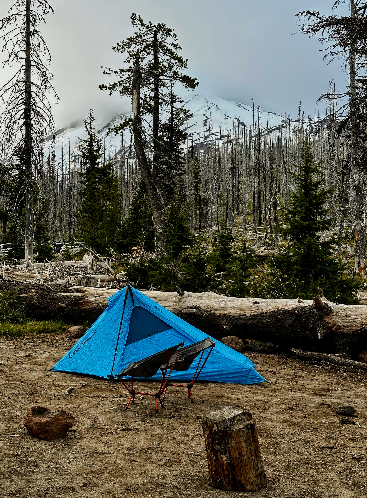
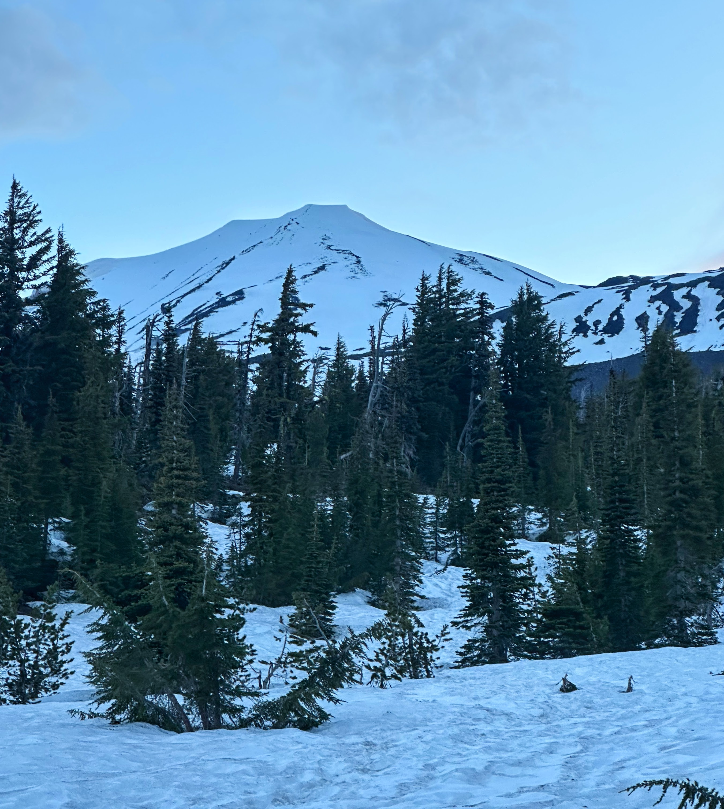
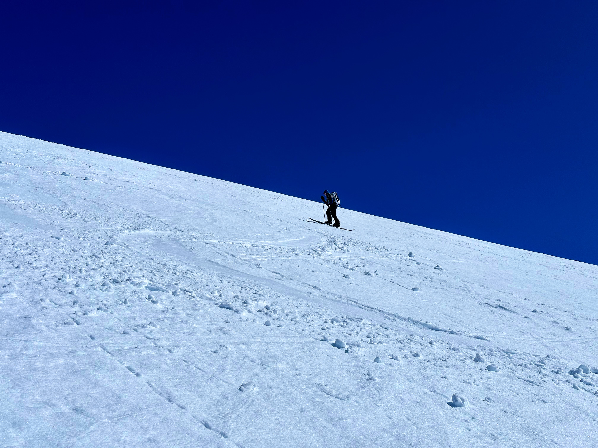
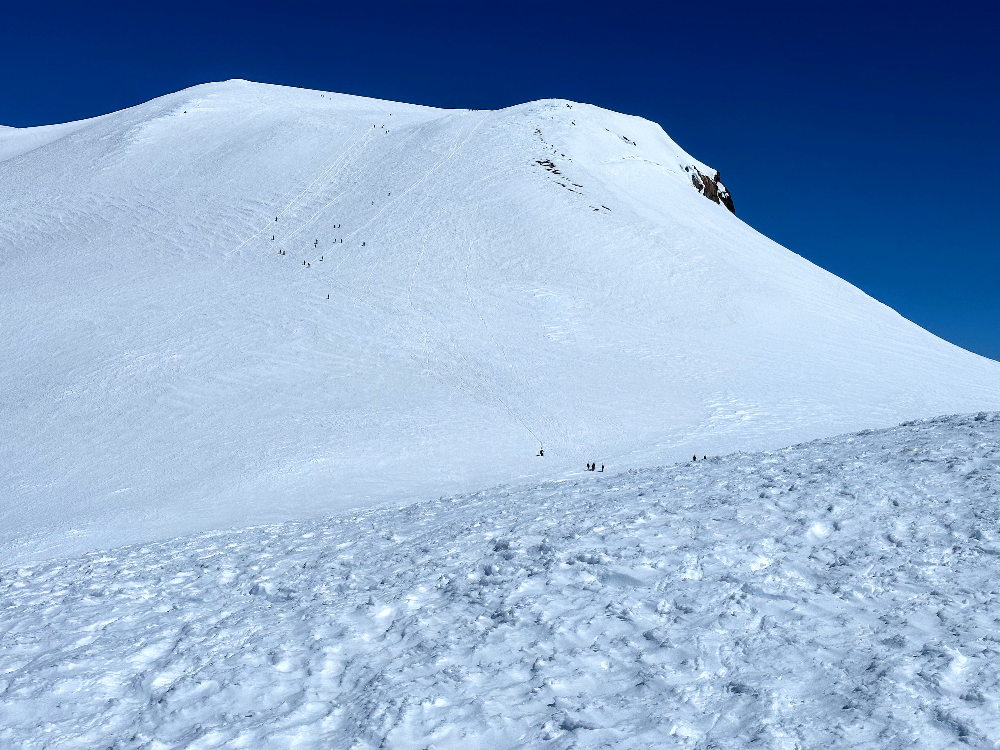
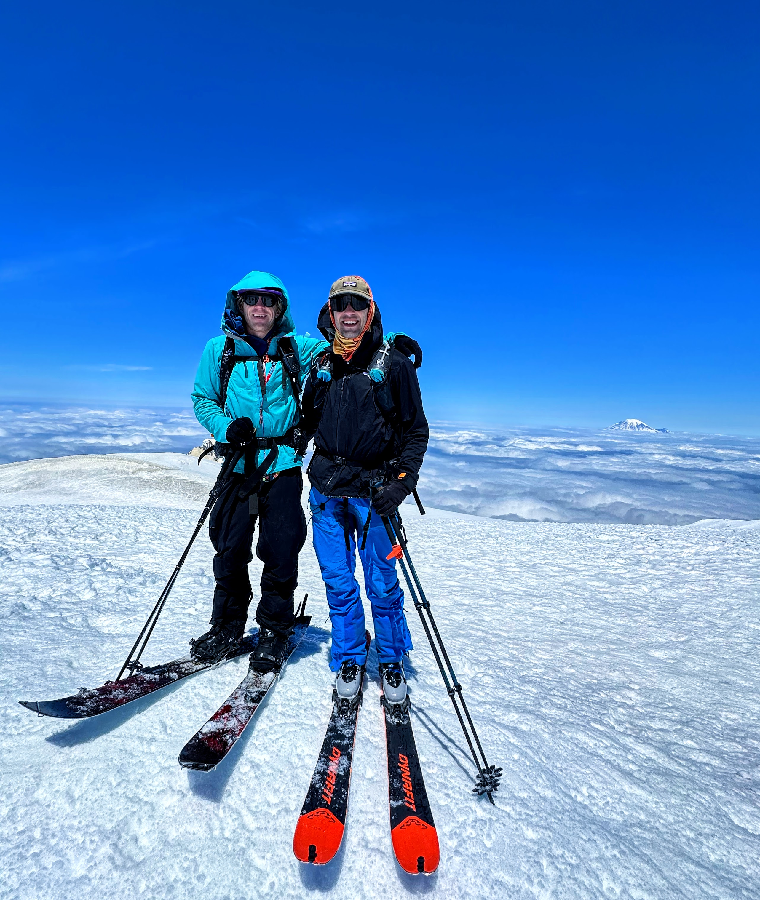
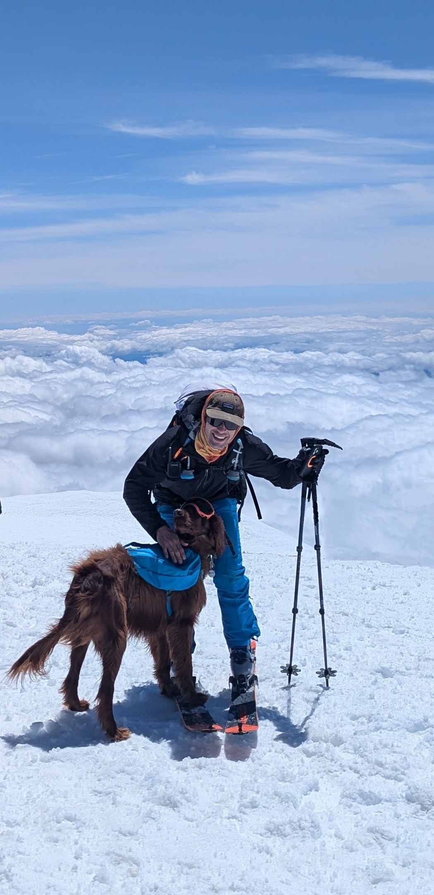
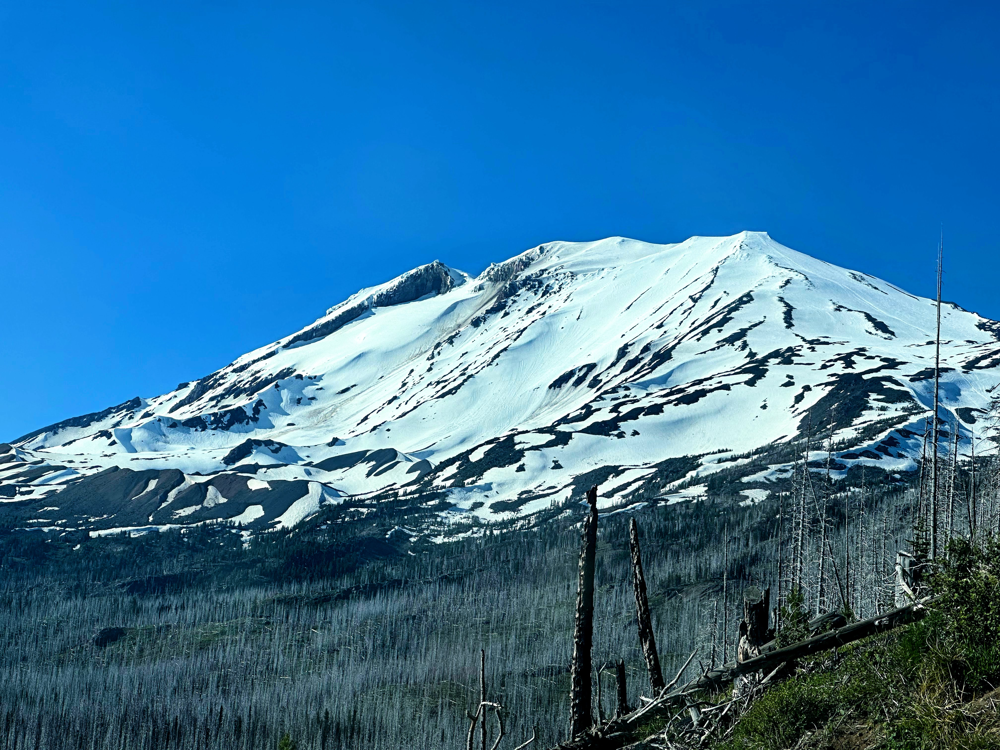

(N.B.: this is a post-hoc trip report, being written in November 2025, a bit over a year after we actually skied Mount Adams.  But just in time to get excited for a new season as it rains here in Seattle and snows up in the mountains!)

Although I didn't learn to ski until I moved to Seattle in 2019 and have only been touring since 2022, my first proper tour---i.e. not just skinning in-bounds terrain to learn how to use my gear---was a mostly off-the-couch ski descent of [Mount Baker / Kulshan](https://en.wikipedia.org/wiki/Mount_Baker).^[Another post-hoc trip report to come of that at some point.] That experience completely hooked me. Being up close and personal with a huge, awe-inspiring mountain, and then having a joy-ride skiing down after suffering through the uphill slog cemented two things for me: (i) no walking down mountains, and (ii) like any good PNW skier, I have to ski all the volcanoes in WA.  The next year, I got shut down on St. Helens twice by bad weather.

After turning around at 12,000 feet on Rainier with a group in 2023,^[Mainly due to bad social dynamics.  Maybe more on that at some point as well.] my friend Hank and I began scheming a more audacious plan for the following summer: an entirely human-powered ascent from Seattle, biking with all of our gear to the mountain for the climb and ski.  Of course, he decided to go and have a kid, so couldn't take the days away from his family in order to make that grand adventure happen.  Luckily, one weekend in the end of June, it looked like the stars were aligning---good weather, enough meltage to drive, but not too much to ruin the skiing, a free weekend---for a go at Washington's second highest peak (and largest by volume): [Adams / Pahto](https://en.wikipedia.org/wiki/Mount_Adams_(Washington)).

We left Seattle mid-day Saturday and had a somewhat long, smooth, and mostly uneventful drive.  It was my first time driving along the north side of the Columbia river,^[having driven portions of I-84 on the south side many times.] which was more scenic than I expected for some reason.  We were able to drive the narrow and bumpy final road with only one close call.  Although fairly crowded, we were able to find a nice little camp site for the short night, had some dinner a little dessert, and watched the mountain and a few critters before calling it a night.

<figure>

<figcaption>A room with a view for the night.</figcaption>
</figure>

We had a semi-alpine start ahead of us, with a 3:45 alarm.  Even on early starts like this, I need a morning coffee to get going.  The snow line didn't quite make it to the lot any more, so we put our skis^[Split-board for Hank.] in A-frame and got to walking at 4:30am on the dot.  With the days being so long at that time of year, there was just enough light coming up over the horizon that we didn't even need to wear headlamps.  After just over a mile and a half, we hit consistent snow and were able to transition to skinning.  Nothing hits quite like taking the skis off your back and putting them on your feet at the start of a long tour.  The clouds also began to burn off and we had a beautiful look at the false summit and the long road ahead.

<figure>

<figcaption>First look at Adams in the morning as we transitioned from walking to skinning.</figcaption>
</figure>

The initial portion of skinning was mostly smooth sailing.   We gained a ridge, which provided views of Mt Hood to the south and a rainbow across the valley, and followed this straight up a long time until we hit "the lunch counter" where many folks were just waking up to get going on their own summit pushes.

<figure>

<figcaption>Hank skinning along the ridge with a rainbow in the background.</figcaption>
</figure>

We took our only substantial-ish break of the day at the lunch counter, taking the packs off and enjoying a snack in the sun.  The next segment---a long, steep slog up Piker's Peak, a false summit---looked like something we should replenish our energy for.  We also put on ski crampons at this point.  I was first up on the struggle bus, about halfway up this portion.  Around 10,000 feet or so, I just started feeling zapped.  Partially the thin air, and som elevation-induced bloating, but probably also a lot to do with just baking in the sun.  Nothing too bad, but a few sections of short pauses every few steps.  Slow and steady and we were at the false summit, looking at the last thousand feet or so to the true summit.

<figure>

<figcaption>Hank skinning up the steep slope towards the false summit on a bluebird day.</figcaption>
</figure>

<figure>

<figcaption>Ants marching up towards the true summit.</figcaption>
</figure>

It was my turn to do the pulling: between 11- and 12,000 ft, Hank began to suffer in much the same way that I had earlier.  But I had a second wind and felt great at that point.  Maybe summit fever, maybe just good timing, who knows.  A lot of folks were booting up the last headwall to the summit, but we were able to keep a good clip and stay on skins and ski crampons the whole way up.  

And what a view up there!  From the second highest point in the state, we enjoyed crystal clear views from above the clouds of the highest point (Rainier/Tahoma), as well as Hood, St Helens, and the central Cascades as well.  Plus, we met a cute dog who made it all the way up.  He was with a Polish couple in their 60s who were amazing: although they didn't look exceptionally fit, they had been ticking off big mountains on their skis for the past several months, and looked very smooth just going slow and steady the whole way up here.  They were headed to Rainier in two days time as well.  #lifegoals 

<figure>

<figcaption>Hank and I standing atop the summit in our skis, with Rainier in the background.</figcaption>
</figure>

<figure>

<figcaption>Me with the cute dog on the summit.</figcaption>
</figure>

We had an uneventful transition into ski mode and rode off the true summit.  It's such a great feeling to be sliding off the top of such a large piece of geology.  Skiing is always fun, but nothing beats getting yourself on to the top of something and then reaping the rewards afterwards.  The 1,000-ish feet back down to Piker's Peak were fine but uneventful skiing; the sun hadn't fully done its work yet---probably a good thing---so things were a bit firm.  Instead of following the climbing route down, we took a turn and found our way to the top of the famous Southwest Chutes.

Famous for a reason: 4000ft of continuous fall-line skiing at a near-perfect 40 degrees.  I had heard a lot about this line and how fun it was, and boy did it live up to the hype!  Our timing for the main chute was nearly perfect, with the snow turning into soft corn just for us.  It was one of the first backcountry lines for me where it really felt like you could open it up and ski hard, which was a very nice feeling.  Most of what we shot during this section is video, so not a ton of pictures here.

The bottom third to a half was a bit too hot, and there were quite a few point-release loose slides.  A little stressful, but nothing too hard to manage.

The heat, however, was brutal on the exit.  Getting up and over a couple of ridges to reconnect to the trail out was _brutal_.  Skins started coming loose from the wet snow and we were sweating like crazy and just wanted to be done.  Needless to say, there's a long period here with no photos at all.  Luckily, we made it back to the pin where we dropped our trail runners, and had a nice pleasant stroll back to the trailhead.

<figure>

<figcaption>Back at the trailhead at the end of the day.</figcaption>
</figure>

It was a perfect day out.  The biggest thing Hank and I had done alone, and probably the biggest tour I had done as an equal in the party.  A very good feeling of accomplishment, met with one of the best tasting car beers possible. 

The drive back was looooong and tiring, but at least it started with a perfect view back on what we had just skied.

<figure>

<figcaption>Looking at the mountain on the way out.  The right side is the climbing route, and the main line between the rocks is the SW Chutes that we skied.</figcaption>
</figure>

Total stats for the day:
- 13.73 miles
- 7,390 ft elevation gain
- 12h39m car-to-car time
- 37.1 mph max speed 

And [a gpx track](adams-sw-chutes.gpx) for those who want one.

