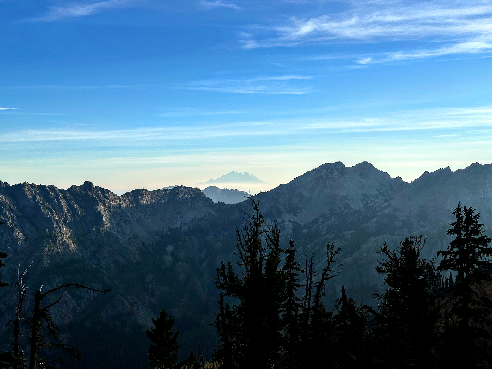
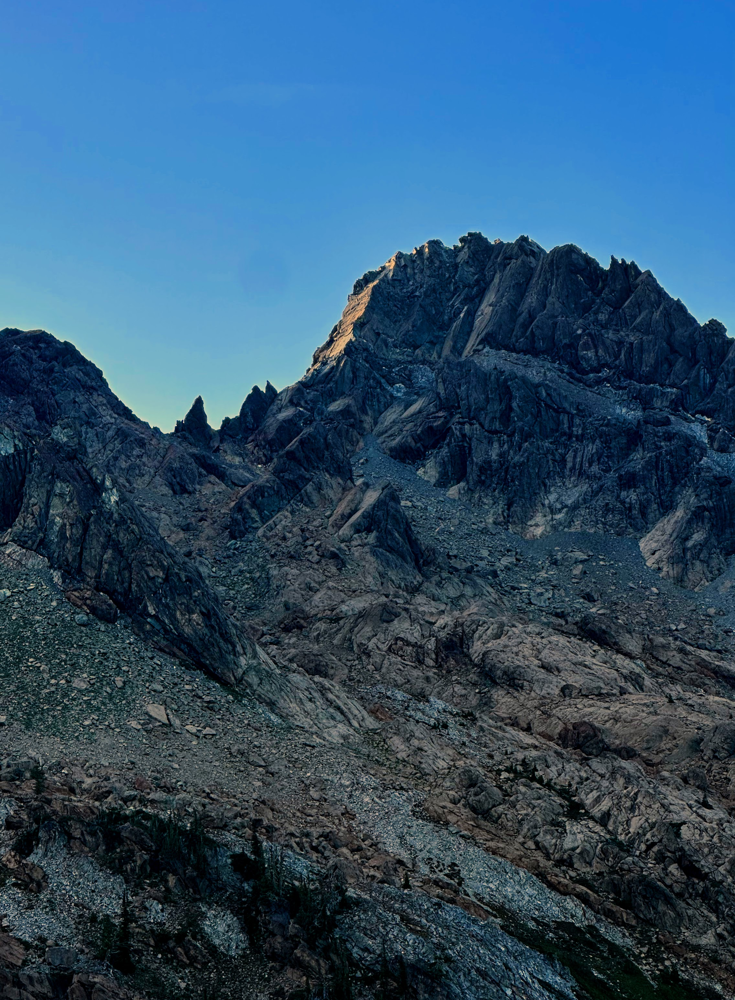
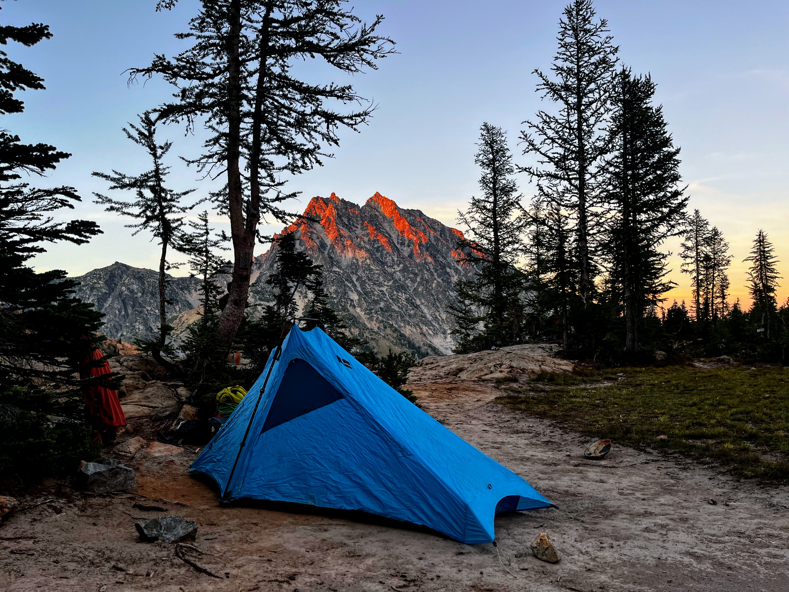
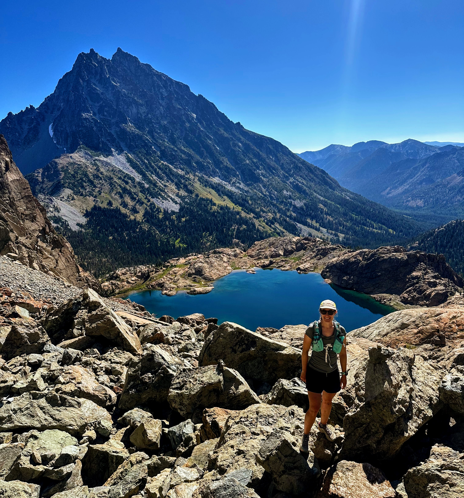
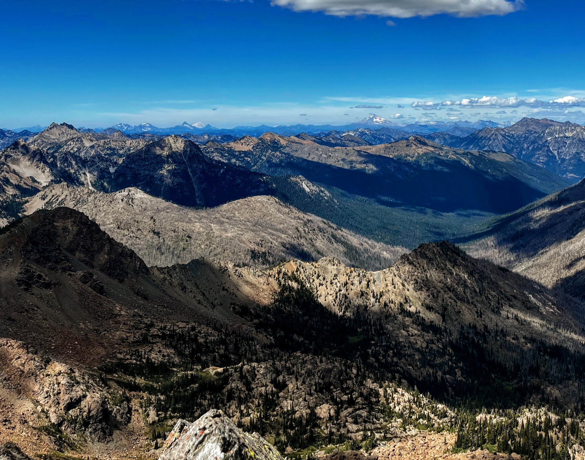

After a lot of multipitch climbing this year in preparation for and culminating in a climb of the West Ridge of Prusik Peak,^[I plan to write about this trip and some of the prep ones soon.] B and I spent most of July on our bikes, riding STP (Seattle to Portland) in one day followed up by RAMROD (Ride Around Mount Rainier in One Day).^[Do organized bike rides deserve trip reports?!]  With summer starting to feel like its beginning to wane, and with lots of travel coming up in September, but also with our bodies being pretty fried, we wanted to take another trip into the alpine.  The goal: at most type 1.5 fun, beautiful views, fun climbing, and hopefully a "cute lil overnighter" as well.  Enter: [Ingalls](https://www.mountainproject.com/area/110928196/ingalls-peak)!

## Day 1: Seattle to camp

In the interest of having a more casual outing, we left Seattle around 2 or 2:30pm on Saturday.  With one pit stop at the Safeway in Cle Elum, we reached the Esmeralda trailhead just after 5pm and started walking around 5:30.  The start of the trail---including the turn on to Ingalls Way trail after about a quarter mile---was great: shady, smooth, with a very gradual rise to gain elevation.  A group of trail runners flying down made it clear to us how imminently runnable this trail is.  Before too long, we were starting to poke above the trees and got our first view of Tahoma (Rainier).

<figure>

<figcaption>Our first view of Tahoma/Rainier in the distance.</figcaption>
</figure>

The trail gradually became more and more exposed and accordingly dusty.  A definite high-desert feel.  After passing a fork for John's Pass, the trail makes almost a straight exposed line for Ingall's pass.  Though the terrain becomes slightly rockier, the trail maintains the gradual rise throughout, so you can really make great time gaining the vert.

On the other side of the pass, you can chooose to stay high or dip low into a basin.^[Trail 1390.1 up high, 1390.2 down low.] We didn't have a ton of beta on campsites, except an expectation that there are more on the low loop, but should be some up high too.  Since the former requires losing and then re-gaining some vert, we stayed up high and began keeping our eyes open for good sites.  It was also at this point that we got our first look at our objective for tomorrow: Ingalls' south ridge/face was catching the last rays of sun.

<figure>

<figcaption>Tomorrow's route (South Ridge of Ingalls) glowing in the day's last sun. Should this be renamed the wall of late evening light?</ficaption>
</figure>

Although it didn't seem like it at first, after another quarter mile or so, you pass through a grove and come to an area with lots of very nice sites, near the one real stream for water and even a pit toilet.  We poked around for a site that optimized tranquility, views, and proximity to water, and settled on a beauty.  We finished setting up the tent just in time to watch the sun set over the majestic Mt Stuart.

<figure>

<figcaption>Our blue Black Diamond tent set up for the night, with Mt Stuart in the background.</figcaption>
</figure>

Speaking of tranquility, the one downside was a group of youths playing music from a boombox a few sites over.^[Not to mention leaving a full-size kitchen trash bag hanging from a tree at their site.]  I'm sure I don't need to get on a soap box here about leaving that at home or at least playing music softly enough so that it doesn't interfere with other peoples' experiences.  Luckily, their music choice was surprisingly enjoyable---Fleetwood Mac, Frank Sinatra, Alanis Morissette, Pink Floyd---and they did shut things down not too long after sunset.

We both recently upgraded to [Nemo Tensor](https://amzn.to/45LfArl) pads, which are amazingly comfortable.  Unfortunately, my ultralight "2-person" tent cannot really fit two wide pads.  Some creative geometry got them sandwiched against each other and the walls of the tent, and we were able to happily pass out after some delicious grocery store sandwiches and a little old fashioned in a plastic bottle.^[My friends know a small cocktail is one of my trail treats.]

## Day 2: the climb and exit

Part of our goal for a type-1.5 alpine climb weekend was avoiding a super early alpine start.^[Ingalls can certainly be done in a day, but with a 2.5 hour drive from Seattle, it turns into a quite long one.]  To that end, we set our alarms for 6:45am, and then slept in a little longer, savoring the comfort of those new Nemo pads.

Around 7:15am, we heard a relatively large group of Mounties^[A.k.a. [Mountaineers](https://www.mountaineers.org/). They tend to travel in relatively large groups.] on the trail, stopping for a bathroom and water-filling break.  This was one other reason for doing this trip as an overnighter: we knew the Mountaineers were having a trip to Ingalls on Sunday 08/10 (and also 08/09), but thought that camping might get us to the climb before they did.  Oh well; you can't have it all.

After a nice coffee and breakfast with a view, we finally left camp at the luxurious hour of 9am.  The half mile or so to Ingalls Lake should have been smooth sailing, and mostly was.  One problem: the heat.  Even at this hour, it was zapping me.  I'm not sure what exactly it was, but I got hit with some extreme nauseau and had to take a short break.^[Couldn't have been last night's little cocktail.]

Luckily, life was restored, and we continued on the approach from the lake, where it takes on a decidedly different character.  In typical Cascade fashion, the last bit of the approach steepens considerably.  Luckily, it started walking up slabs, which made for great time.  We followed a lush gully a bit too high, and had to do some traverse-y shenanigans to get farther right and into a proper scree gully for the final bit of the approach.  Because of the heat, the going was a little slower than normal, but it wasn't too long before we were at the base of the climb.  One party had just started^[Turns out, this was the last of the Mounties.] and another was gearing up to go.  A line, but not too bad of one.

<figure>

<figcaption>B in the scree gully, with Ingalls Lake and Mt Stuart in the background.</figcaption>
</figure>

We were almost done getting geared up for the route when the final scare of the day hit: we thought B had left her belay device at home.  Turns out, it was just really far back on her harness.  My apparently-very-angry face wiped clean, it was time to start the climb.

The first two pitches were very fast.  Aside from 5-10 feet near the top of pitch 1, it felt entirely like a scramble.  I eventually put one cam and clipped in to the anchor on pitch 1 and linked it with "pitch" 2.  This was 15 meters of pure scrambling, where I didn't place any additional protection at all.  We joined our friends---named S and P---from the base at the very large ledge^[Sometimes called "the dance floor".] while waiting for the earlier party to clear out of the pitch 3 anchors.

Pitch 3 looked like a great pitch of actual rock climbing.  The first half has two cracks: a 5.4 to the left and a 5.6 up the middle.  The former gives the route its grade, but the latter was both more aesthetic and more natural a line, so I opted for that one.  Although my nascent crack climbing skills leave something to be desired, this pitch was still low-angle enough that it never felt insecure.  Progress was fast, and whenver I wanted to place a piece, I could find a good foot jam in the crack to hang out and make sure it was alright.

<figure>

<figcaption>Me, putting in another piece of protection from a very good stance halfway up pitch 3.  This is at the end of the 5.6 crack crux of the route, which was quite fun and protected well.</figcaption>
</figure>

Halfway up, the pitch traverses horizontally along an interesting juggy crack, then up a few feet into 10-20 feet of easy terrain before one more crack to an anchor.  This one is on the characteristically-slippery rock (called "serpentine" for reasons I need to look up).  So even though it was not physically difficult, I took even extra care to place my feet securely on the relatively frictionless rock.  Before too long, I was clipping into a luxurious bolted anchor after a very fun pitch.^[And one where I was happy with my placements and extensions, having zero rope drag even at the top.]

The fourth and final pitch was fairly short and unremarkable as well.  Two pieces in total; after placing the second, I waited for awhile as a party worked to begin the rappel from the anchor, which admittedly involved an awkward lower-off from the top.  Once they were on their way, a little climb up a corner on very slick rock lead to a juggy lip and a comfortable top out at another bolted anchor.  I rose above to find our friends S and P fully napping on the summit waiting for their turn to rap down after the Mounties.

After talking with them and deciding to join ropes to make the rappel down the route faster, B and I put our approach shoes back on and walked over a few hundred feet to tag the actual summit.  The views here were amazing: in addition to Stuart,^[Washington's second largest non-volcanic mountain.] we enjoyed views of Dakobed / Glacier Peak, Kulshan / Mt Baker, Tahoma / Rainier, Pahto / Adams, and even Wy'east / Hood in the distance.  Not to mention the rest of the Alpine Lakes Wilderness in the Snoqualmie pass region as well.  Hard to beat that kind of summit view!

<figure>

<figcaption>Dakobed / Glacier Peak and Kulshan / Mt Baker in the distance, looking north/west from the summit of Ingalls Peak.</ficaption>
</figure>

Two double-length rappels had us back at the base in no time.  Somehow, we stayed too low in the scree field this time, and had to do even weirder shenanigans to get back over to the gully / slabs on the way back to the lake.  But oh was it worth it: a quick dip in the lake brought me back to life after roasting in the sun all day.^[I much prefer the victory dip to the sport-climbers' victory whip.] A perfect cap to the day.

We got back to camp just after 5pm, had a quick snack and were fast to break things down, and were on our way by 5:45.  A smooth and uneventul---minus encroaching foot soreness and hunger---walk back out brought us to the car in an hour and a half.  

Type 1.5 fun indeed; just what the doctor ordered.