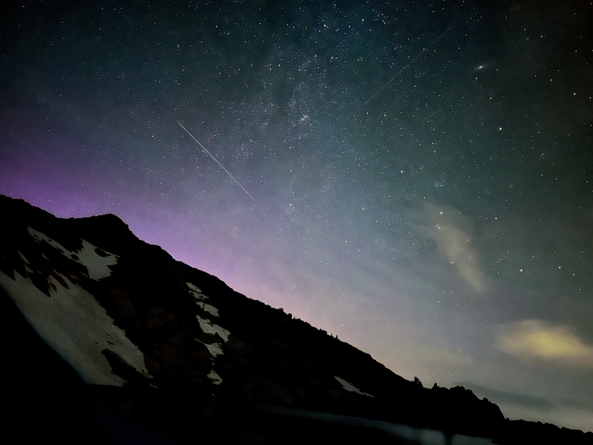
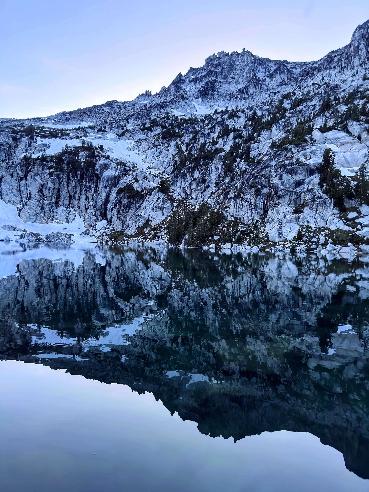
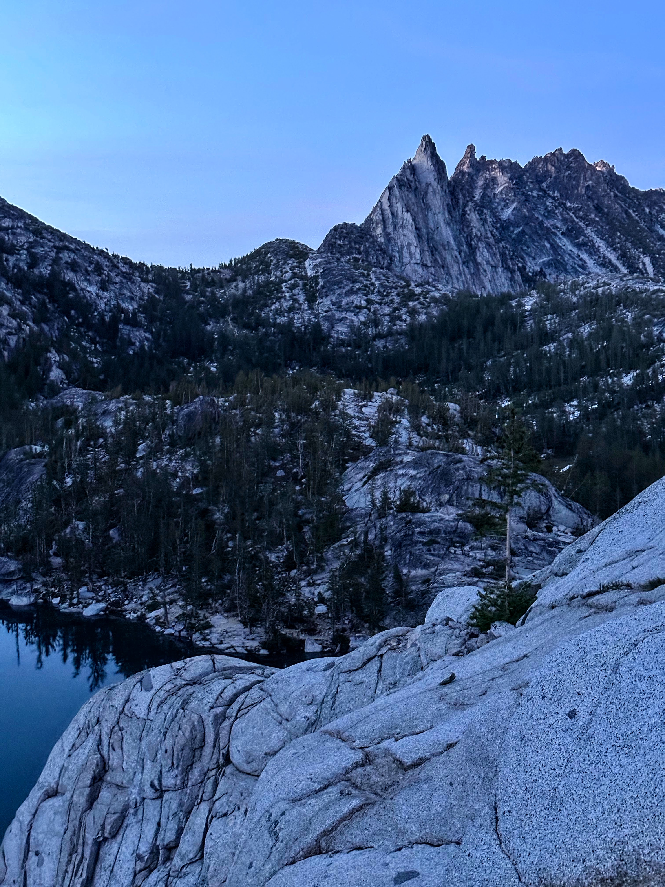
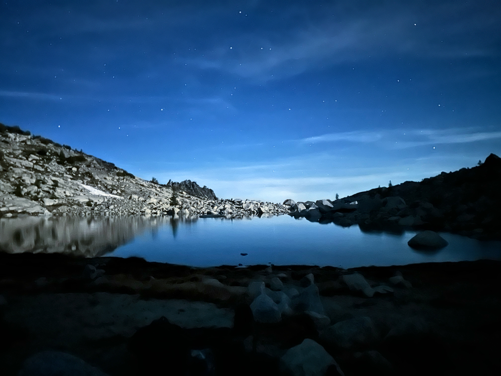

<figure>

<figcaption>Stars and a bit of aurora in the middle of the night, taken from just outside the tent.</figcaption>
</figure>

<figure>

<figcaption>Looking up at the start of the route, with the prominent white crack.</figcaption>
</figure>

<figure>

<figcaption>Looking down from the top of pitch two, with the air step visible at the base of the slab.</figcaption>
</figure>

<figure>

<figcaption>Trad anchor at the end of pitch three.  Because of some far/odd placements, I used a girth hitch on a carabiner for the master point, a technique I'd recently learned from Adam Butterfield.</figcaption>
</figure>

<figure>

<figcaption>Ian and B tip-toeing around a large boulder on the traverse-y section of pitch three, after the (not-pictured) crux slab.</figcaption>
</figure>

<figure>

<figcaption>The 5.8 finger crack variation to the final pitch.</figcaption>
</figure>

<figure>

<figcaption>Inspiration Lake, with Enchantment Peak reflecting.</figcaption>
</figure>

<figure>

<figcaption>Perfection Lake, with Little Annapurna and McLellan Peak visible and Tahoma/Rainier way in the distance.</figcaption>
</figure>

<figure>

<figcaption>Prusik Peak, with the west ridge route visible, as seen on the way back to camp.</figcaption>
</figure>

<figure>

<figcaption>The stars began to come out just as we finished dinner.</figcaption>
</figure>