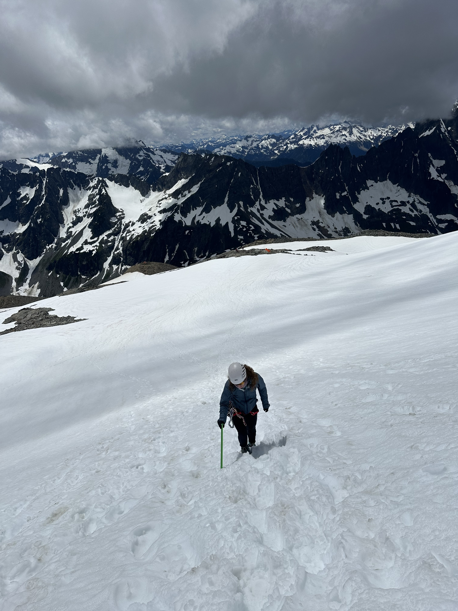
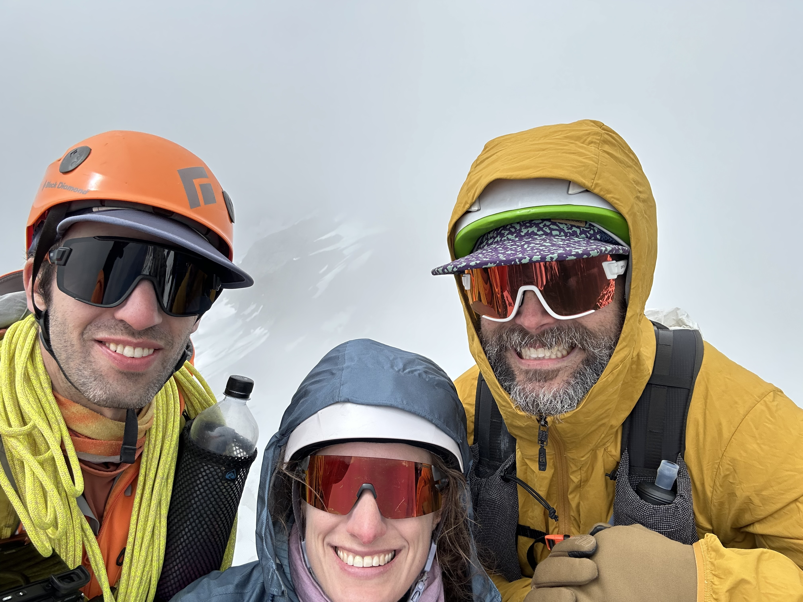
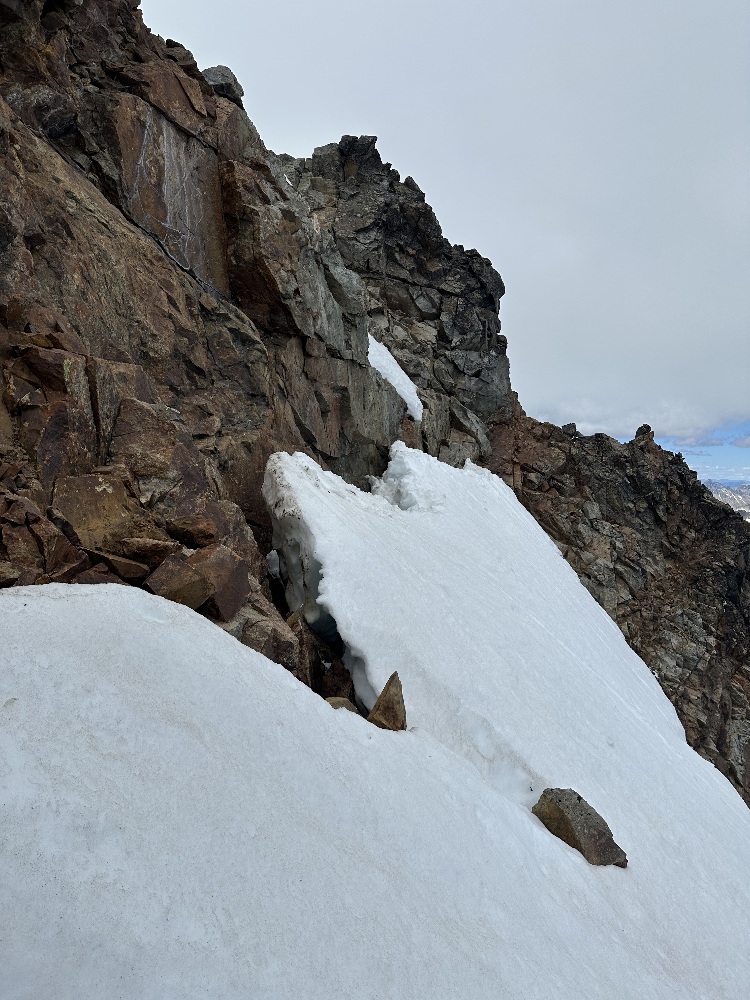
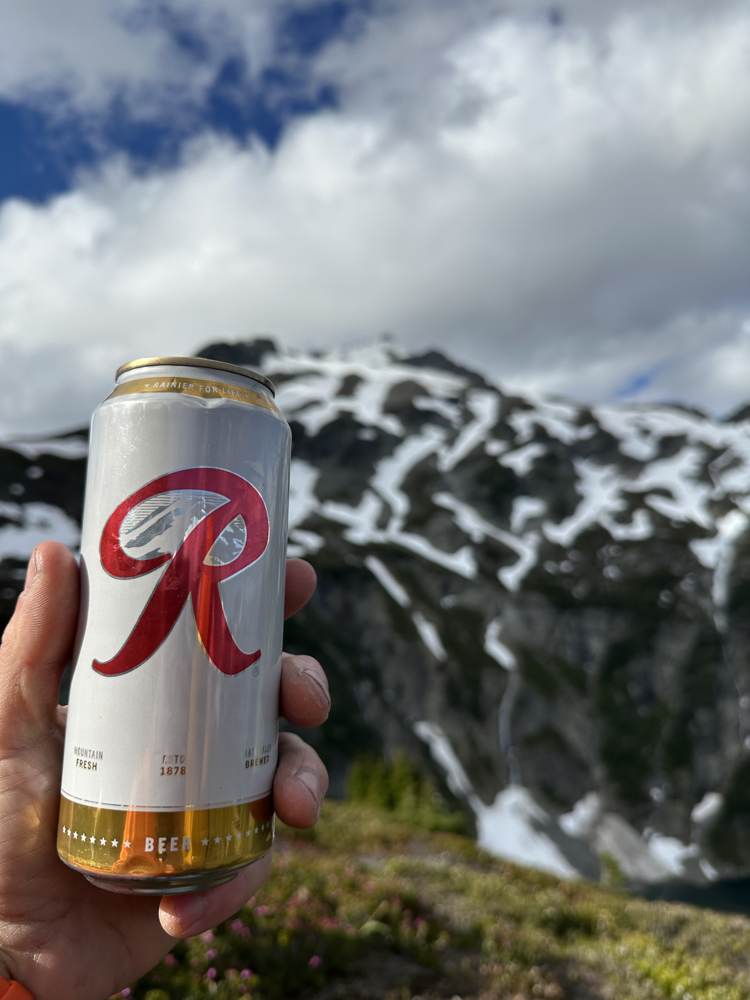

Following both on a tradition of my friend Ian and I aiming for an alpine adventure at least once a summer and our successful [trip to Prusik](../prusik/index.md) with B on July 4 weekend last year, the three of us set our sights on the same weekend this year.  B had recently taken a crevasse rescue class and wanted to whet her feet^[And maybe even wet them too!] with some glacier travel, so we eyed [Sahale Peak](https://en.wikipedia.org/wiki/Sahale_Mountain) for its combination of pleasant approach, stunning views, and a relatively simple glacier approach to its summit block.

On the topic of an easy approach: B was also able to snag a car camping spot at the Mineral Park campground on Cascade River Road, about 3 miles short of the Eldorado trailhead and 6 miles short of our starting point at the very popular Cascade Pass trailhead.  That last three miles of road had not yet opened for the season, but we were hopeful that the National Parks Service would open it up for the busy holiday weekend.  I had stayed at this exact campground when friends visited me the very first summer I was in Seattle, in early September 2019.  On that trip, it was grey and wet for the entire three days we were there, so we spent a ton of time reading in our tents before at least hiking to Cascade Pass, where we had exactly 50 feet of visibility in what is otherwise a majestic zone.  

We left camp at a reasonable hour and were thrilled to cruise past an open gate at Eldorado and drive all the way up to Cascade Pass; shrinking an approximate 19 miles down to an approximate 13.  Arriving at around 7:30am, cars were already overflowing a ways down the road, but we were able to squeeze in to one last parallel spot and get going.  The hike up to Cascade Pass was smooth and uneventful.  This time, at least, I could actually see the natural beauty here!

<figure>

<figcaption>The view from Cascade Pass; my first time seeing it.</figcaption>
</figure>

From the pass, the crowds thinned somewhat as we headed up the slightly steeper Sahale Arm.  Highlights of this leg included a good amount of wildlife: several goats, a bellowing ptarmigan, and many marmots, including several wrestling for minutes on end.

<figure>

<figcaption>Two marmots mid-wrestle.</figcaption>
</figure>

It was not too long before we had our first look at the day's objective.  I've seen Sahale from the Boston Basin and Eldorado side,^[From an ascent of Forbidden Peak and a ski circumnavigation of Eldorado, both of which are candidates for future post-hoc trip reports.] but this was my first view from this angle.  More stunning than I had anticipated!

<figure>

<figcaption>Our first look at Sahale Peak and the namesake glacier we'd be traveling to reach the peak.</figcaption>
</figure>

As we got towards the end of the arm, the pitch steepened back up and turned into more of a scree and talus field.  The last portion before reaching the glacier itself was a bit of a zapper, especially under a bright sun, but we also probably could have fueled a bit better.  Nevertheless, it wasn't too long before we were at the transition point to put crampons on and step on to the Sahale glacier.  B would also be wearing mountaineering boots for the first time; I put universal aluminum crampons on my trust approach shoes.

<figure>

<figcaption>The path ahead up the Sahale glacier to the summit block.</figcaption>
</figure>

We chose not to rope up for at least the initial uphill portion on the glacier, since it had a very well-maintained boot pack and no visible cracking.  Once we reached the flat shelf in the middle, we re-assessed, but again chose not to rope up, since there were only a couple of crevasses and the well-established path easily skirted around them to the right.  We did this rightward traverse and soon were on a final mildly steep slope to the base of the summit block; steep enough for a bit of self-belay with our ice axes to be needed.

<figure>

<figcaption>B walking up the first steep-ish snow pitch.</figcaption>
</figure>

After stashing axes, poles and crampons at the base, we scrambled up the summit pyramid.  It was surprisingly fun movement, with a move or two on the upper half that I'd say were low-fifth-class to get around a bulge in a corner.  I tagged the glacier cord up this portion and set up a terrain anchor to put B (and those big boots) on belay for that portion.  

<figure>

<figcaption>B starting up the one spicy portion of the summit scramble.</figcaption>
</figure>

Before too long, we stood together on top of Sahale.  I subjected Ian and B to an obligatory summit selfie.  By this point, forecasted clouds were beginning to roll in, so it looked a bit more like my previous trip to Cascade Pass than the glorious sun of the first half of the day.  Despite the clouds, spirits were high!  It had been relatively smooth sailing to this point, 6.5hrs from the car to the summit.

<figure>

<figcaption>Summit selfie on top of Sahale!</figcaption>
</figure>

But maybe the clouds were trying to tell us something.  One party down-climbed past us on the way up, saying they were a little cold and didn't want to wait.  At the summit, there were several people waiting to rappel, but we thought it wouldn't be too bad.  Although the main culprit was primarily a large and slow group of four Mountaineers,^[With a capital "M".] the wait was exacerbated by another couple who scrambled up but didn't have a plan to get down and didn't feel comfortable down-climbing.  One had a harness but no hardware for rappelling and the other had nothing at all.  Say what you will about the Mountaineers,^[And I've said my share in other places.] they are always prepared.  The last of their group gave the harness-clad person their rappel device and rigged a munter hitch to rappel on, and then sent a harness and device up from the ground for the other member of the under-prepared party.  All told, we waited _an hour and a half_ to start rappelling.  And it was indeed a cold hour and a half.  In retrospect, we should have just lowered B back through that cruxy portion and downclimbed as well.

Turns out: the wait wasn't the end of our worries.  We only brought my 30-meter 6mm glacier cord on the route.  While we had tested it for rappelling at camp the day before, we didn't have real beta on how long the rappels were on this block.  I went first, and couldn't reach a mid-point second rap anchor.  I found my way to a ledge wide enough to stand on comfortably, and from which it looked to be an easy down-climb, and called for B and Ian to join.

We went up and around a corner to what looked to be easier terrain to downclimb.  While some of the down-climbing was straightforward, some of it was also a bit exposed.  When we were low enough and needed to get back around the corner to the side with our gear, we were partially blocked by a steep snow-field.  Without our sharp things (which we were trying to get back to), it looked a bit too spicy to just walk across.  Ian forged ahead and found a path, first bridging across the non-trivial bergschrund before "swimming" down and walking under it and climbing back out on the other side.  I had B on a short rope already at this point for the exposed down-climb, so went ahead and had her on belay with the heavy snow of the bergschrund serving as a useful anchor.  After overcoming the fear of the steep snow and bergschrund shenanigans, she made it through swimmingly and we rejoiced on the far side.  

Turns out, type 1 fun can become type 2 when a small bit of under-preparedness leads you into sketchier situations than planned.

<figure>

<figcaption>Looking back at the bergschrund on the steep snow slope that we crossed.  We started by briding across the gap at the far end, before swimming down into the moat and then climbing back out to where the photo is taken.</figcaption>
</figure>

Reunited with our gear, the walk back down the glacier was mostly smooth sailing.  One of B's crampons started misbehaving; eventually, she just strapped it to the pack and finished with one sharp foot and one normal.  Back on the rocks, we hoped to stop for a proper snack break, but it had gotten properly windy by that point, so we trudged on until we could find calmer pastures.  Turns out, that would be quite a bit longer than we anticipated, as most of the arm was exposed to high ridgeline winds.  This portion down turned into a bit of a "death march" vibe just because everyone was hungry, thirsty, and wind-blasted.  As we got lower, the return of the wildlife helped lift our spirits, including multiple goat families who seemed to know where to go for the best views.

<figure>

<figcaption>A mountain goat with the majestic Johannesburg in the background.</figcaption>
</figure>

We finally stopped at the same place where we got our first look at the peak earlier in the day.  I surprised the gang with a Rainier beer that I had carried the whole day.  Wrong mountain, but it hit the spot along with some real food as we warmed up with long-sought protection from the wind.  

<figure>

<figcaption>A Rainier with Sahale in the background.</figcaption>
</figure>

Spirits lifted, we powered back down to Cascade Pass and cruised from there back to the car.  Although we got ourselves into a bit of a situation on the way down with our short rope, the gang still had a great time in a beautiful place.   The luxuriousness of the weekend also helped, knowing we had warm tacos to cook back at our car camp.  This felt like the best way to celebrate the complicated 250th birthday of the USA.

Some stats:
- 13.77 miles
- 5529ft elevation gain
- 12h12m car-to-car (with 1.5hrs waiting on the summit to rappel)